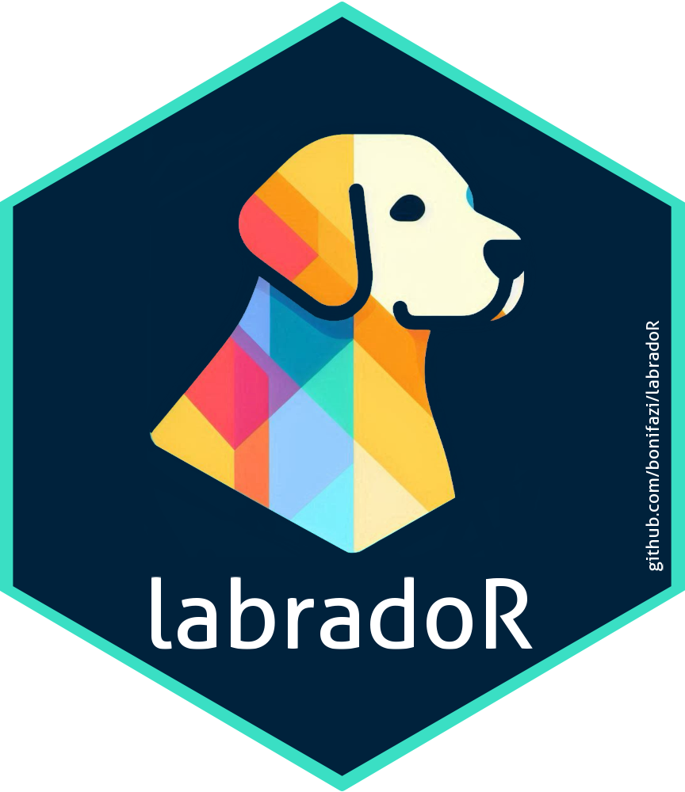

<!-- README.md is generated from README.Rmd. Please edit that file -->

# labradoR

<!-- badges: start -->


[](https://github.com/bonifazi/labradoR/actions/workflows/R-CMD-check.yaml)

<!-- badges: end -->



The goal of the `labradoR` R package is to facilitate the handling and
post-processing in R of the output from
[`Retriever`](https://genebankdata.cgn.wur.nl/software/software.html)
software.

`Retriever` is a software for retrieving information on population
structure, inbreeding, and kinship from pedigrees analysis generating
many statistics and plots. For more information on `Retriever` please
refer to the [official software
website](https://genebankdata.cgn.wur.nl/software/software.html) and it
associated [publication](https://www.mdpi.com/2076-2615/11/5/1332).

`labradoR` help users to import the output generated by `Retriever` into
R for further manipulation and downstream analyses. `labradoR` loads the
main tabular information into `data.frames` and generates associated
`ggplot2` plots objects similar to those of `Retriever`.

## Installation

You can install the development version of `labradoR` from
[GitHub](https://github.com/) with:

``` r
# install.packages("devtools")
devtools::install_github("bonifazi/labradoR")
```

## Usage

The below is a basic example showing the package usage. As input, you
need to provide the path to the `.out` file generated by `Retriever`.
Note that the `.out` file can be in English or in Dutch (depending on
the settings used when running `Retriever`). Both languages are
supported: set the needed language using the `language` argument (ENG
for English and DUT for Dutch).

    library(labradoR)
    ## example usage
    output <- process_retriever(file_name = "C:/myPath/pedigree_Retriever.out",
     language = "ENG")

    str(output, max.levels = 1, give.attr = F)

Note: since the logic of `labradoR` is that of “fetching” lines from
`Retriever`’s output, if anything changes in the format of the `.out`
file, then `labradoR`’s associated code will need to be adapted
accordingly.

Note that sub-populations are not supported yet.

The current `labradoR` version `1.1.0` has been tested and used for the
output of `Retriver` version compiled on `08-02-2025`.  
Older versions are compatible with older `Retriever` output, and are
kept for legacy. You can install an older version of `labradoR` using,
for example:

``` r
# install.packages("devtools")
devtools::install_github("bonifazi/labrador@v1.0.0")
```

Legacy list:

- `labradoR` version `1.0.0` has been tested and used with
  `Retriever v7`.

## Example output

You can find an example of the output generated by `labradoR`
[here](doc/Create_report_sheep_example.md).  
Note that this report is just to show the main outputs of the package.
Here `Retriever` was run on a sheep pedigree simulated using
[`MoBPS`](https://github.com/tpook92/MoBPS) (code
[here](dev/Simulate_sheep_test_dataset.R) ). Real pedigrees will likely
show much more uneven distributions.

## Citation

If you use the `labradoR` package in your research, please cite it as
follows:

1.  **Citing the Software**

    To cite the software directly, you can use the following format in
    your work:

    - Bonifazi, R. (2025). labradoR: An R package for handling and
      post-processing Retriever output. Version 1.1.0. Retrieved from
      <https://github.com/bonifazi/labradoR>.

2.  **Citing the Associated Paper**

    A paper is currently in preparation. For now, you can refer to the
    associated presentation:

    - Winding, J. J., Meuwissen, T. H. E., Croiseau, P., Restoux, G., &
      Bonifazi, R. (2023). Impact of genomic selection on genetic
      diversity in five European local cattle breeds. Proceedings of the
      74th Annual Meeting of the European Federation of Animal Science,
      Lyon, France (p. 160).

## Contributing

You are welcome to contribute to the development of `labradoR`.

#### How to Contribute

- Feature Requests: If you have a new feature in mind or a suggestion
  for improvement, please open a GitHub issue to discuss it.

- Bug Reports: If you encounter any bugs or issues while using
  `labradoR`, please submit a bug report with detailed information about
  the problem.

- Pull Requests: feel free to fork the repository, make your changes,
  and submit a pull request.

## News and Updates

Check out the [NEWS](NEWS.md) file for the latest updates and changes to
the package.

## Acknowledgements

- [Jack J. Windig](https://research.wur.nl/en/persons/jack-windig) for
  helping with the interpretation of the `Retriever`’s output.

- [Julia Höglund](https://github.com/juliahoglund) for helping editing
  with `labradoR` logo.

- [Torsten Pook](https://github.com/tpook92) for helping with the
  `MoBPS` simulations.
