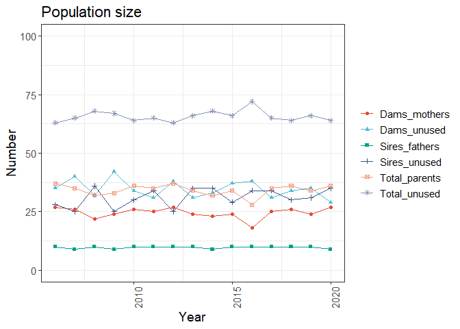
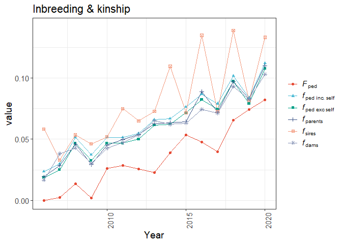
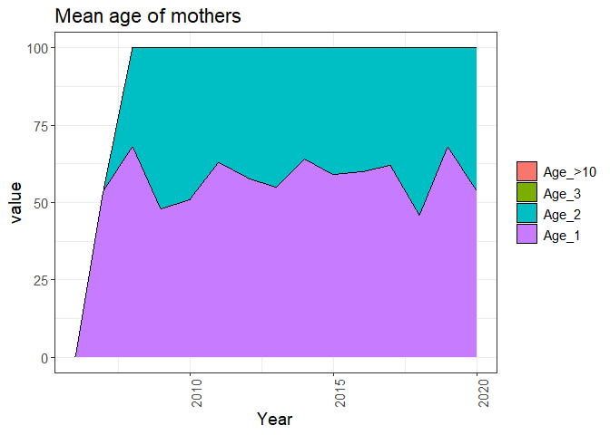
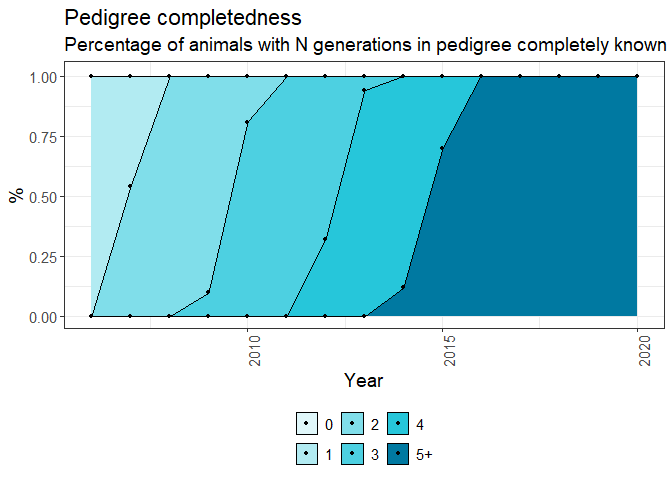

Simulation Results Report
================
2025-08-02

``` r
packageVersion("labradoR")
```

    ## [1] '1.1.6'

Example of running labradoR (the `xinterval` and `delta_intervals`
arguments are optional arguments).

``` r
sim_results <- labradoR::process_retriever(params$input_file, language = params$language, xinterval = c(2006, 2020), delta_intervals = c(2006, 2008, 2010, 2014, 2020))
```

    ## 
    ##  >> Extracting Population Size

    ## Scale for x is already present.
    ## Adding another scale for x, which will replace the existing scale.
    ## Scale for x is already present.
    ## Adding another scale for x, which will replace the existing scale.

    ## 
    ##  >> Extracting Inbreeding

    ## Scale for x is already present.
    ## Adding another scale for x, which will replace the existing scale.

    ## 
    ##  >> Extracting Generation Intervals
    ##  >> Extracting Mean Age of Fathers

    ## Scale for x is already present.
    ## Adding another scale for x, which will replace the existing scale.

    ## 
    ##  >> Extracting Mean Age of Mothers

    ## Scale for x is already present.
    ## Adding another scale for x, which will replace the existing scale.

    ## 
    ##  >> Extracting Pedigree Completeness

    ## Scale for x is already present.
    ## Adding another scale for x, which will replace the existing scale.

    ## 
    ##  >> Extracting Litter Size Information

    ## Scale for x is already present.
    ## Adding another scale for x, which will replace the existing scale.

    ## 
    ##  >> Extracting Top Sires Contribution

    ## Scale for x is already present.
    ## Adding another scale for x, which will replace the existing scale.

    ## 
    ##  >> Extracting Compute Deltas

# Description

Report generated from retriever output file using the {labradoR} R
package.

Given input file is
C:/Users/bonif002/OneDrive/labradoR_simulation/Retriever/www/upload/sheep_ped.out,
with ENG as language.

## Population size

``` r
kable(sim_results$pop_size)
```

| Year | Sires_unused | Sires_fathers | Dams_unused | Dams_mothers | Total_unused | Total_parents | %\_males_calves |
|-----:|-------------:|--------------:|------------:|-------------:|-------------:|--------------:|----------------:|
| 2005 |           30 |            10 |          33 |           27 |           63 |            37 |              40 |
| 2006 |           28 |            10 |          35 |           27 |           63 |            37 |              38 |
| 2007 |           25 |             9 |          40 |           26 |           65 |            35 |              34 |
| 2008 |           36 |            10 |          32 |           22 |           68 |            32 |              46 |
| 2009 |           25 |             9 |          42 |           24 |           67 |            33 |              34 |
| 2010 |           30 |            10 |          34 |           26 |           64 |            36 |              40 |
| 2011 |           34 |            10 |          31 |           25 |           65 |            35 |              44 |
| 2012 |           25 |            10 |          38 |           27 |           63 |            37 |              35 |
| 2013 |           35 |            10 |          31 |           24 |           66 |            34 |              45 |
| 2014 |           35 |             9 |          33 |           23 |           68 |            32 |              44 |
| 2015 |           29 |            10 |          37 |           24 |           66 |            34 |              39 |
| 2016 |           34 |            10 |          38 |           18 |           72 |            28 |              44 |
| 2017 |           34 |            10 |          31 |           25 |           65 |            35 |              44 |
| 2018 |           30 |            10 |          34 |           26 |           64 |            36 |              40 |
| 2019 |           31 |            10 |          35 |           24 |           66 |            34 |              41 |
| 2020 |           35 |             9 |          29 |           27 |           64 |            36 |              44 |
| 2021 |           31 |            10 |          34 |           25 |           65 |            35 |              41 |
| 2022 |           38 |            10 |          32 |           20 |           70 |            30 |              48 |
| 2023 |           51 |             0 |          49 |            0 |          100 |             0 |              51 |
| 2024 |           42 |             0 |          58 |            0 |          100 |             0 |              42 |

``` r
print(sim_results$pop_size_plot)
```

<!-- -->

``` r
print(sim_results$sex_ratio_plot)
```

<!-- -->

## Sex ratio

``` r
print(sim_results$sex_ratio_plot)
```

<!-- -->

## Inbreeding

``` r
kable(sim_results$inbreeding)
```

| Year | F_all_animals | f_inc.self | f_exc.self | f_parents | f_sires | f_dams |
|-----:|--------------:|-----------:|-----------:|----------:|--------:|-------:|
| 2005 |        0.0000 |     0.0227 |     0.0179 |    0.0163 |  0.0194 | 0.0175 |
| 2006 |        0.0000 |     0.0235 |     0.0187 |    0.0193 |  0.0583 | 0.0167 |
| 2007 |        0.0025 |     0.0298 |     0.0250 |    0.0284 |  0.0330 | 0.0382 |
| 2008 |        0.0137 |     0.0514 |     0.0468 |    0.0462 |  0.0535 | 0.0429 |
| 2009 |        0.0022 |     0.0372 |     0.0326 |    0.0294 |  0.0462 | 0.0302 |
| 2010 |        0.0259 |     0.0515 |     0.0468 |    0.0451 |  0.0519 | 0.0426 |
| 2011 |        0.0286 |     0.0514 |     0.0468 |    0.0499 |  0.0750 | 0.0471 |
| 2012 |        0.0255 |     0.0546 |     0.0500 |    0.0540 |  0.0650 | 0.0533 |
| 2013 |        0.0226 |     0.0660 |     0.0615 |    0.0626 |  0.0727 | 0.0649 |
| 2014 |        0.0388 |     0.0669 |     0.0623 |    0.0635 |  0.1095 | 0.0620 |
| 2015 |        0.0533 |     0.0763 |     0.0717 |    0.0642 |  0.0716 | 0.0632 |
| 2016 |        0.0475 |     0.0866 |     0.0822 |    0.0889 |  0.1348 | 0.0744 |
| 2017 |        0.0397 |     0.0790 |     0.0745 |    0.0721 |  0.0727 | 0.0713 |
| 2018 |        0.0657 |     0.1015 |     0.0972 |    0.0969 |  0.1387 | 0.0931 |
| 2019 |        0.0741 |     0.0837 |     0.0791 |    0.0830 |  0.0814 | 0.0825 |
| 2020 |        0.0821 |     0.1119 |     0.1076 |    0.1100 |  0.1332 | 0.1030 |
| 2021 |        0.0651 |     0.0981 |     0.0937 |    0.0987 |  0.1080 | 0.1001 |
| 2022 |        0.0843 |     0.1214 |     0.1171 |    0.1223 |  0.1396 | 0.1176 |
| 2023 |        0.0745 |     0.1077 |     0.1033 |        NA |      NA |     NA |
| 2024 |        0.1274 |     0.1418 |     0.1375 |        NA |      NA |     NA |

``` r
print(sim_results$inbreeding_plot)
```

<!-- -->

## Generation intervals

``` r
kable(sim_results$gen_intervals)
```

| Year | mean_age_sires | mean_age_dams | mean_age_both_parents |
|-----:|---------------:|--------------:|----------------------:|
| 2005 |              0 |          0.00 |                  0.00 |
| 2006 |              0 |          0.00 |                  0.00 |
| 2007 |              2 |          2.00 |                  2.00 |
| 2008 |              2 |          2.32 |                  2.16 |
| 2009 |              2 |          2.52 |                  2.26 |
| 2010 |              2 |          2.49 |                  2.24 |
| 2011 |              2 |          2.37 |                  2.18 |
| 2012 |              2 |          2.42 |                  2.21 |
| 2013 |              2 |          2.45 |                  2.22 |
| 2014 |              2 |          2.36 |                  2.18 |
| 2015 |              2 |          2.41 |                  2.20 |
| 2016 |              2 |          2.40 |                  2.20 |
| 2017 |              2 |          2.38 |                  2.19 |
| 2018 |              2 |          2.54 |                  2.27 |
| 2019 |              2 |          2.32 |                  2.16 |
| 2020 |              2 |          2.46 |                  2.23 |
| 2021 |              2 |          2.45 |                  2.22 |
| 2022 |              2 |          2.44 |                  2.22 |
| 2023 |              2 |          2.34 |                  2.17 |
| 2024 |              2 |          2.31 |                  2.16 |

``` r
print(sim_results$gen_intervals_plot)
```

    ## NULL

## Mean Age of Fathers

``` r
kable(sim_results$mean_age_fathers)
```

| Year | Age_1 | Age_2 |
|-----:|------:|------:|
| 2005 |     0 |     0 |
| 2006 |     0 |     0 |
| 2007 |   100 |     0 |
| 2008 |   100 |     0 |
| 2009 |   100 |     0 |
| 2010 |   100 |     0 |
| 2011 |   100 |     0 |
| 2012 |   100 |     0 |
| 2013 |   100 |     0 |
| 2014 |   100 |     0 |
| 2015 |   100 |     0 |
| 2016 |   100 |     0 |
| 2017 |   100 |     0 |
| 2018 |   100 |     0 |
| 2019 |   100 |     0 |
| 2020 |   100 |     0 |
| 2021 |   100 |     0 |
| 2022 |   100 |     0 |
| 2023 |   100 |     0 |
| 2024 |   100 |     0 |

``` r
print(sim_results$mean_age_fathers_plot)
```

<!-- -->

## Mean Age of Mothers

``` r
kable(sim_results$mean_age_mothers)
```

| Year | Age_1 | Age_2 | Age_3 |
|-----:|------:|------:|------:|
| 2005 |     0 |     0 |     0 |
| 2006 |     0 |     0 |     0 |
| 2007 |    54 |     0 |     0 |
| 2008 |    68 |    32 |     0 |
| 2009 |    48 |    52 |     0 |
| 2010 |    51 |    49 |     0 |
| 2011 |    63 |    37 |     0 |
| 2012 |    58 |    42 |     0 |
| 2013 |    55 |    45 |     0 |
| 2014 |    64 |    36 |     0 |
| 2015 |    59 |    41 |     0 |
| 2016 |    60 |    40 |     0 |
| 2017 |    62 |    38 |     0 |
| 2018 |    46 |    54 |     0 |
| 2019 |    68 |    32 |     0 |
| 2020 |    54 |    46 |     0 |
| 2021 |    55 |    45 |     0 |
| 2022 |    56 |    44 |     0 |
| 2023 |    66 |    34 |     0 |
| 2024 |    69 |    31 |     0 |

``` r
print(sim_results$mean_age_mothers_plot)
```

<!-- -->

## Pedigree completeness

``` r
kable(sim_results$pedigree_completeness)
```

| Year | average_generation_equivalent | %\_animals_with_0_generations_in_pedigree_completely_known | %\_animals_with_1_generations_in_pedigree_completely_known | %\_animals_with_2_generations_in_pedigree_completely_known | %\_animals_with_3_generations_in_pedigree_completely_known | %\_animals_with_4_generations_in_pedigree_completely_known | %\_animals_with_5+\_generations_in_pedigree_completely_known |
|-----:|------------------------------:|-----------------------------------------------------------:|-----------------------------------------------------------:|-----------------------------------------------------------:|-----------------------------------------------------------:|-----------------------------------------------------------:|-------------------------------------------------------------:|
| 2005 |                          1.00 |                                                          0 |                                                       1.00 |                                                       0.00 |                                                       0.00 |                                                       0.00 |                                                         0.00 |
| 2006 |                          1.00 |                                                          0 |                                                       1.00 |                                                       0.00 |                                                       0.00 |                                                       0.00 |                                                         0.00 |
| 2007 |                          1.77 |                                                          0 |                                                       0.46 |                                                       0.54 |                                                       0.00 |                                                       0.00 |                                                         0.00 |
| 2008 |                          2.00 |                                                          0 |                                                       0.00 |                                                       1.00 |                                                       0.00 |                                                       0.00 |                                                         0.00 |
| 2009 |                          2.53 |                                                          0 |                                                       0.00 |                                                       0.90 |                                                       0.10 |                                                       0.00 |                                                         0.00 |
| 2010 |                          2.95 |                                                          0 |                                                       0.00 |                                                       0.19 |                                                       0.81 |                                                       0.00 |                                                         0.00 |
| 2011 |                          3.39 |                                                          0 |                                                       0.00 |                                                       0.00 |                                                       1.00 |                                                       0.00 |                                                         0.00 |
| 2012 |                          3.85 |                                                          0 |                                                       0.00 |                                                       0.00 |                                                       0.68 |                                                       0.32 |                                                         0.00 |
| 2013 |                          4.23 |                                                          0 |                                                       0.00 |                                                       0.00 |                                                       0.06 |                                                       0.94 |                                                         0.00 |
| 2014 |                          4.72 |                                                          0 |                                                       0.00 |                                                       0.00 |                                                       0.00 |                                                       0.88 |                                                         0.12 |
| 2015 |                          5.12 |                                                          0 |                                                       0.00 |                                                       0.00 |                                                       0.00 |                                                       0.30 |                                                         0.70 |
| 2016 |                          5.71 |                                                          0 |                                                       0.00 |                                                       0.00 |                                                       0.00 |                                                       0.00 |                                                         1.00 |
| 2017 |                          6.05 |                                                          0 |                                                       0.00 |                                                       0.00 |                                                       0.00 |                                                       0.00 |                                                         1.00 |
| 2018 |                          6.49 |                                                          0 |                                                       0.00 |                                                       0.00 |                                                       0.00 |                                                       0.00 |                                                         1.00 |
| 2019 |                          7.00 |                                                          0 |                                                       0.00 |                                                       0.00 |                                                       0.00 |                                                       0.00 |                                                         1.00 |
| 2020 |                          7.39 |                                                          0 |                                                       0.00 |                                                       0.00 |                                                       0.00 |                                                       0.00 |                                                         1.00 |
| 2021 |                          7.89 |                                                          0 |                                                       0.00 |                                                       0.00 |                                                       0.00 |                                                       0.00 |                                                         1.00 |
| 2022 |                          8.30 |                                                          0 |                                                       0.00 |                                                       0.00 |                                                       0.00 |                                                       0.00 |                                                         1.00 |
| 2023 |                          8.87 |                                                          0 |                                                       0.00 |                                                       0.00 |                                                       0.00 |                                                       0.00 |                                                         1.00 |
| 2024 |                          9.24 |                                                          0 |                                                       0.00 |                                                       0.00 |                                                       0.00 |                                                       0.00 |                                                         1.00 |

``` r
print(sim_results$pedigree_completeness_plot)
```

<!-- -->

## Average Generation Equivalent

``` r
print(sim_results$average_generation_equivalent_plot)
```

<!-- -->

## Litter size

``` r
kable(sim_results$littersize)
```

| Year | Number_nests | calves_per_nest | number_fathers | nests_per_father | calves_per_father |
|-----:|-------------:|----------------:|---------------:|-----------------:|------------------:|
| 2005 |           32 |            3.12 |              9 |             3.56 |             11.11 |
| 2006 |           29 |            3.45 |              9 |             3.22 |             11.11 |
| 2007 |           31 |            3.23 |              9 |             3.44 |             11.11 |
| 2008 |           33 |            3.03 |              9 |             3.67 |             11.11 |
| 2009 |           32 |            3.12 |              8 |             4.00 |             12.50 |
| 2010 |           29 |            3.45 |              9 |             3.22 |             11.11 |
| 2011 |           25 |            4.00 |              8 |             3.12 |             12.50 |
| 2012 |           30 |            3.33 |              9 |             3.33 |             11.11 |
| 2013 |           32 |            3.12 |              9 |             3.56 |             11.11 |
| 2014 |           27 |            3.70 |              9 |             3.00 |             11.11 |
| 2015 |           31 |            3.23 |              9 |             3.44 |             11.11 |
| 2016 |           26 |            3.85 |              8 |             3.25 |             12.50 |
| 2017 |           26 |            3.85 |              9 |             2.89 |             11.11 |
| 2018 |           30 |            3.33 |              9 |             3.33 |             11.11 |
| 2019 |           27 |            3.70 |              9 |             3.00 |             11.11 |
| 2020 |           31 |            3.23 |              9 |             3.44 |             11.11 |
| 2021 |           28 |            3.57 |              9 |             3.11 |             11.11 |
| 2022 |           31 |            3.23 |              8 |             3.88 |             12.50 |
| 2023 |           32 |            3.12 |              9 |             3.56 |             11.11 |
| 2024 |           30 |            3.33 |              9 |             3.33 |             11.11 |

``` r
print(sim_results$littersize_plot)
```

<!-- -->

## Top Sires

``` r
kable(sim_results$topsires)
```

| Year | Nr_sires | topsire 1 | topsire 2 | topsire 3 | topsire 4 | topsire 5 | topsire 6 | topsire 7 | topsire 8 | topsire 9 | topsire 10 |
|-----:|---------:|----------:|----------:|----------:|----------:|----------:|----------:|----------:|----------:|----------:|-----------:|
| 2005 |       10 |        21 |        14 |        13 |        10 |        10 |         9 |         9 |         8 |         4 |          2 |
| 2006 |       10 |        19 |        19 |        10 |        10 |        10 |        10 |         9 |         8 |         3 |          2 |
| 2007 |       10 |        16 |        14 |        13 |        13 |        10 |         9 |         8 |         7 |         6 |          4 |
| 2008 |       10 |        21 |        18 |        13 |        12 |         9 |         8 |         7 |         7 |         3 |          2 |
| 2009 |        9 |        19 |        14 |        13 |        13 |        12 |         8 |         7 |         7 |         7 |          0 |
| 2010 |       10 |        17 |        15 |        14 |        13 |        13 |        10 |         7 |         5 |         4 |          2 |
| 2011 |        9 |        19 |        16 |        13 |        12 |        12 |        12 |         8 |         6 |         2 |          0 |
| 2012 |       10 |        15 |        15 |        13 |        12 |        12 |        10 |         8 |         7 |         7 |          1 |
| 2013 |       10 |        17 |        16 |        15 |        12 |        11 |        10 |         7 |         6 |         4 |          2 |
| 2014 |       10 |        16 |        15 |        14 |        12 |        10 |         8 |         8 |         8 |         5 |          4 |
| 2015 |       10 |        17 |        15 |        11 |        11 |        11 |        10 |         9 |         8 |         5 |          3 |
| 2016 |        9 |        24 |        16 |        15 |        13 |        11 |         8 |         6 |         5 |         2 |          0 |
| 2017 |       10 |        18 |        15 |        13 |        12 |        10 |        10 |         7 |         6 |         5 |          4 |
| 2018 |       10 |        21 |        18 |        12 |         9 |         9 |         8 |         8 |         8 |         5 |          2 |
| 2019 |       10 |        19 |        17 |        15 |        11 |        10 |         9 |         6 |         5 |         4 |          4 |
| 2020 |       10 |        18 |        15 |        15 |         9 |         9 |         9 |         8 |         7 |         7 |          3 |
| 2021 |       10 |        24 |        21 |        16 |         7 |         7 |         7 |         6 |         5 |         4 |          3 |
| 2022 |        9 |        19 |        17 |        16 |        14 |        13 |        10 |         5 |         4 |         2 |          0 |
| 2023 |       10 |        23 |        18 |        14 |        11 |         7 |         7 |         7 |         6 |         4 |          3 |
| 2024 |       10 |        21 |        14 |        14 |        11 |        10 |        10 |         9 |         7 |         2 |          2 |

``` r
print(sim_results$topsires_plot)
```

<!-- -->

## Annual and generational rates

F = inbreeding, f = kinship, L = generation interval.

``` r
kable(sim_results$deltas)
```

| intervals | annual_delta_F | annual_delta_f | average_L | generation_delta_F | generation_delta_f |
|:----------|---------------:|---------------:|----------:|-------------------:|-------------------:|
| 2006-2008 |           0.69 |           1.45 |      1.39 |               0.96 |               2.01 |
| 2008-2010 |           0.62 |           0.00 |      2.22 |               1.38 |               0.00 |
| 2010-2014 |           0.21 |           0.48 |      2.21 |               0.45 |               1.07 |
| 2014-2020 |           0.72 |           0.65 |      2.20 |               1.59 |               1.43 |
