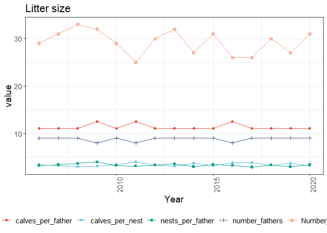

Simulation Results Report
================
2025-04-14

``` r
packageVersion("labradoR")
```

    ## [1] '1.1.4'

Example of running labradoR (the `xinterval` and `delta_intervals`
arguments are optional arguments).

``` r
sim_results <- labradoR::process_retriever(params$input_file, language = params$language, xinterval = c(2006, 2020), delta_intervals = c(2006, 2008, 2010, 2014, 2020))
```

    ## 
    ##  >> Extracting Population Size

    ## Scale for x is already present.
    ## Adding another scale for x, which will replace the existing scale.
    ## Scale for x is already present.
    ## Adding another scale for x, which will replace the existing scale.

    ## 
    ##  >> Extracting Inbreeding

    ## Scale for x is already present.
    ## Adding another scale for x, which will replace the existing scale.

    ## 
    ##  >> Extracting Generation Intervals
    ##  >> Extracting Mean Age of Fathers

    ## Scale for x is already present.
    ## Adding another scale for x, which will replace the existing scale.

    ## 
    ##  >> Extracting Mean Age of Mothers

    ## Scale for x is already present.
    ## Adding another scale for x, which will replace the existing scale.

    ## 
    ##  >> Extracting Pedigree Completeness

    ## Scale for x is already present.
    ## Adding another scale for x, which will replace the existing scale.

    ## 
    ##  >> Extracting Litter Size Information

    ## Scale for x is already present.
    ## Adding another scale for x, which will replace the existing scale.

    ## 
    ##  >> Extracting Top Sires Contribution

    ## Scale for x is already present.
    ## Adding another scale for x, which will replace the existing scale.

    ## 
    ##  >> Extracting Compute Deltas

# Description

Report generated from retriever output file using the {labradoR} R
package.

Given input file is
C:/Users/bonif002/OneDrive/labradoR_simulation/Retriever/www/upload/sheep_ped.out,
with ENG as language.

## Population size

``` r
kable(sim_results$pop_size)
```

| Year | Sires_unused | Sires_fathers | Dams_unused | Dams_mothers | Total_unused | Total_parents | %\_males_calves |
|-----:|-------------:|--------------:|------------:|-------------:|-------------:|--------------:|----------------:|
| 2005 |           38 |             9 |          36 |           17 |           74 |            26 |              47 |
| 2006 |           30 |            10 |          36 |           24 |           66 |            34 |              40 |
| 2007 |           40 |             8 |          31 |           21 |           71 |            29 |              48 |
| 2008 |           40 |            10 |          27 |           23 |           67 |            33 |              50 |
| 2009 |           37 |            10 |          29 |           24 |           66 |            34 |              47 |
| 2010 |           34 |             9 |          31 |           26 |           65 |            35 |              43 |
| 2011 |           34 |            10 |          34 |           22 |           68 |            32 |              44 |
| 2012 |           37 |            10 |          29 |           24 |           66 |            34 |              47 |
| 2013 |           32 |            10 |          33 |           25 |           65 |            35 |              42 |
| 2014 |           32 |            10 |          32 |           26 |           64 |            36 |              42 |
| 2015 |           31 |            10 |          32 |           27 |           63 |            37 |              41 |
| 2016 |           33 |             9 |          34 |           24 |           67 |            33 |              42 |
| 2017 |           34 |             9 |          33 |           24 |           67 |            33 |              43 |
| 2018 |           42 |            10 |          25 |           23 |           67 |            33 |              52 |
| 2019 |           30 |             9 |          33 |           28 |           63 |            37 |              39 |
| 2020 |           32 |            10 |          33 |           25 |           65 |            35 |              42 |
| 2021 |           38 |            10 |          29 |           23 |           67 |            33 |              48 |
| 2022 |           38 |             8 |          35 |           19 |           73 |            27 |              46 |
| 2023 |           54 |             0 |          46 |            0 |          100 |             0 |              54 |
| 2024 |           50 |             0 |          50 |            0 |          100 |             0 |              50 |

``` r
print(sim_results$pop_size_plot)
```

<!-- -->

``` r
print(sim_results$sex_ratio_plot)
```

<!-- -->

## Sex ratio

``` r
print(sim_results$sex_ratio_plot)
```

<!-- -->

## Inbreeding

``` r
kable(sim_results$inbreeding)
```

| Year | F_all_animals | f_inc.self | f_exc.self | f_parents | f_sires | f_dams |
|-----:|--------------:|-----------:|-----------:|----------:|--------:|-------:|
| 2005 |        0.0000 |     0.0247 |     0.0199 |    0.0312 |  0.1076 | 0.0184 |
| 2006 |        0.0000 |     0.0219 |     0.0171 |    0.0145 |  0.0167 | 0.0163 |
| 2007 |        0.0200 |     0.0639 |     0.0594 |    0.0688 |  0.1060 | 0.0570 |
| 2008 |        0.0037 |     0.0305 |     0.0257 |    0.0270 |  0.0368 | 0.0235 |
| 2009 |        0.0581 |     0.0880 |     0.0836 |    0.0788 |  0.0602 | 0.0868 |
| 2010 |        0.0259 |     0.0484 |     0.0437 |    0.0429 |  0.0675 | 0.0433 |
| 2011 |        0.0573 |     0.0710 |     0.0664 |    0.0636 |  0.0904 | 0.0555 |
| 2012 |        0.0320 |     0.0642 |     0.0596 |    0.0595 |  0.0589 | 0.0623 |
| 2013 |        0.0473 |     0.0759 |     0.0714 |    0.0856 |  0.1665 | 0.0717 |
| 2014 |        0.0660 |     0.0727 |     0.0681 |    0.0689 |  0.0688 | 0.0695 |
| 2015 |        0.0612 |     0.1011 |     0.0968 |    0.0904 |  0.0945 | 0.0922 |
| 2016 |        0.0661 |     0.0839 |     0.0793 |    0.0848 |  0.1134 | 0.0800 |
| 2017 |        0.0684 |     0.0931 |     0.0887 |    0.0966 |  0.0956 | 0.0950 |
| 2018 |        0.0526 |     0.0958 |     0.0914 |    0.1020 |  0.1305 | 0.1034 |
| 2019 |        0.0760 |     0.1026 |     0.0982 |    0.1005 |  0.0946 | 0.1027 |
| 2020 |        0.0770 |     0.1155 |     0.1112 |    0.1133 |  0.1171 | 0.1122 |
| 2021 |        0.0889 |     0.1039 |     0.0995 |    0.0984 |  0.1360 | 0.0891 |
| 2022 |        0.0967 |     0.1184 |     0.1141 |    0.1219 |  0.1559 | 0.1156 |
| 2023 |        0.0929 |     0.1170 |     0.1126 |        NA |      NA |     NA |
| 2024 |        0.1156 |     0.1397 |     0.1355 |        NA |      NA |     NA |

``` r
print(sim_results$inbreeding_plot)
```

<!-- -->

## Generation intervals

``` r
kable(sim_results$gen_intervals)
```

| Year | mean_age_sires | mean_age_dams | mean_age_both_parents |
|-----:|---------------:|--------------:|----------------------:|
| 2005 |              0 |          0.00 |                  0.00 |
| 2006 |              0 |          0.00 |                  0.00 |
| 2007 |              2 |          2.00 |                  2.00 |
| 2008 |              2 |          2.34 |                  2.17 |
| 2009 |              2 |          2.45 |                  2.22 |
| 2010 |              2 |          2.35 |                  2.18 |
| 2011 |              2 |          2.33 |                  2.16 |
| 2012 |              2 |          2.44 |                  2.22 |
| 2013 |              2 |          2.46 |                  2.23 |
| 2014 |              2 |          2.30 |                  2.15 |
| 2015 |              2 |          2.46 |                  2.23 |
| 2016 |              2 |          2.46 |                  2.23 |
| 2017 |              2 |          2.53 |                  2.27 |
| 2018 |              2 |          2.58 |                  2.29 |
| 2019 |              2 |          2.45 |                  2.22 |
| 2020 |              2 |          2.50 |                  2.25 |
| 2021 |              2 |          2.41 |                  2.20 |
| 2022 |              2 |          2.40 |                  2.20 |
| 2023 |              2 |          2.48 |                  2.24 |
| 2024 |              2 |          2.30 |                  2.15 |

``` r
print(sim_results$gen_intervals_plot)
```

    ## NULL

## Mean Age of Fathers

``` r
kable(sim_results$mean_age_fathers)
```

| Year | Age_1 | Age_2 |
|-----:|------:|------:|
| 2005 |     0 |     0 |
| 2006 |     0 |     0 |
| 2007 |   100 |     0 |
| 2008 |   100 |     0 |
| 2009 |   100 |     0 |
| 2010 |   100 |     0 |
| 2011 |   100 |     0 |
| 2012 |   100 |     0 |
| 2013 |   100 |     0 |
| 2014 |   100 |     0 |
| 2015 |   100 |     0 |
| 2016 |   100 |     0 |
| 2017 |   100 |     0 |
| 2018 |   100 |     0 |
| 2019 |   100 |     0 |
| 2020 |   100 |     0 |
| 2021 |   100 |     0 |
| 2022 |   100 |     0 |
| 2023 |   100 |     0 |
| 2024 |   100 |     0 |

``` r
print(sim_results$mean_age_fathers_plot)
```

<!-- -->

## Mean Age of Mothers

``` r
kable(sim_results$mean_age_mothers)
```

| Year | Age_1 | Age_2 | Age_3 |
|-----:|------:|------:|------:|
| 2005 |     0 |     0 |     0 |
| 2006 |     0 |     0 |     0 |
| 2007 |    39 |     0 |     0 |
| 2008 |    66 |    34 |     0 |
| 2009 |    55 |    45 |     0 |
| 2010 |    65 |    35 |     0 |
| 2011 |    67 |    33 |     0 |
| 2012 |    56 |    44 |     0 |
| 2013 |    54 |    46 |     0 |
| 2014 |    70 |    30 |     0 |
| 2015 |    54 |    46 |     0 |
| 2016 |    54 |    46 |     0 |
| 2017 |    47 |    53 |     0 |
| 2018 |    42 |    58 |     0 |
| 2019 |    55 |    45 |     0 |
| 2020 |    50 |    50 |     0 |
| 2021 |    59 |    41 |     0 |
| 2022 |    60 |    40 |     0 |
| 2023 |    52 |    48 |     0 |
| 2024 |    70 |    30 |     0 |

``` r
print(sim_results$mean_age_mothers_plot)
```

<!-- -->

## Pedigree completeness

``` r
kable(sim_results$pedigree_completeness)
```

| Year | average_generation_equivalent | %\_animals_with_0_generations_in_pedigree_completely_known | %\_animals_with_1_generations_in_pedigree_completely_known | %\_animals_with_2_generations_in_pedigree_completely_known | %\_animals_with_3_generations_in_pedigree_completely_known | %\_animals_with_4_generations_in_pedigree_completely_known | %\_animals_with_5+\_generations_in_pedigree_completely_known |
|-----:|------------------------------:|-----------------------------------------------------------:|-----------------------------------------------------------:|-----------------------------------------------------------:|-----------------------------------------------------------:|-----------------------------------------------------------:|-------------------------------------------------------------:|
| 2005 |                          1.00 |                                                          0 |                                                       1.00 |                                                       0.00 |                                                       0.00 |                                                       0.00 |                                                         0.00 |
| 2006 |                          1.00 |                                                          0 |                                                       1.00 |                                                       0.00 |                                                       0.00 |                                                       0.00 |                                                         0.00 |
| 2007 |                          1.69 |                                                          0 |                                                       0.61 |                                                       0.39 |                                                       0.00 |                                                       0.00 |                                                         0.00 |
| 2008 |                          2.00 |                                                          0 |                                                       0.00 |                                                       1.00 |                                                       0.00 |                                                       0.00 |                                                         0.00 |
| 2009 |                          2.62 |                                                          0 |                                                       0.00 |                                                       0.75 |                                                       0.25 |                                                       0.00 |                                                         0.00 |
| 2010 |                          2.94 |                                                          0 |                                                       0.00 |                                                       0.24 |                                                       0.76 |                                                       0.00 |                                                         0.00 |
| 2011 |                          3.47 |                                                          0 |                                                       0.00 |                                                       0.00 |                                                       1.00 |                                                       0.00 |                                                         0.00 |
| 2012 |                          3.87 |                                                          0 |                                                       0.00 |                                                       0.00 |                                                       0.64 |                                                       0.36 |                                                         0.00 |
| 2013 |                          4.35 |                                                          0 |                                                       0.00 |                                                       0.00 |                                                       0.09 |                                                       0.91 |                                                         0.00 |
| 2014 |                          4.78 |                                                          0 |                                                       0.00 |                                                       0.00 |                                                       0.00 |                                                       0.87 |                                                         0.13 |
| 2015 |                          5.29 |                                                          0 |                                                       0.00 |                                                       0.00 |                                                       0.00 |                                                       0.37 |                                                         0.63 |
| 2016 |                          5.60 |                                                          0 |                                                       0.00 |                                                       0.00 |                                                       0.00 |                                                       0.04 |                                                         0.96 |
| 2017 |                          6.11 |                                                          0 |                                                       0.00 |                                                       0.00 |                                                       0.00 |                                                       0.00 |                                                         1.00 |
| 2018 |                          6.49 |                                                          0 |                                                       0.00 |                                                       0.00 |                                                       0.00 |                                                       0.00 |                                                         1.00 |
| 2019 |                          6.97 |                                                          0 |                                                       0.00 |                                                       0.00 |                                                       0.00 |                                                       0.00 |                                                         1.00 |
| 2020 |                          7.41 |                                                          0 |                                                       0.00 |                                                       0.00 |                                                       0.00 |                                                       0.00 |                                                         1.00 |
| 2021 |                          7.79 |                                                          0 |                                                       0.00 |                                                       0.00 |                                                       0.00 |                                                       0.00 |                                                         1.00 |
| 2022 |                          8.31 |                                                          0 |                                                       0.00 |                                                       0.00 |                                                       0.00 |                                                       0.00 |                                                         1.00 |
| 2023 |                          8.75 |                                                          0 |                                                       0.00 |                                                       0.00 |                                                       0.00 |                                                       0.00 |                                                         1.00 |
| 2024 |                          9.27 |                                                          0 |                                                       0.00 |                                                       0.00 |                                                       0.00 |                                                       0.00 |                                                         1.00 |

``` r
print(sim_results$pedigree_completeness_plot)
```

<!-- -->

## Average Generation Equivalent

``` r
print(sim_results$average_generation_equivalent_plot)
```

<!-- -->

## Litter size

``` r
kable(sim_results$littersize)
```

| Year | Number_nests | calves_per_nest | number_fathers | nests_per_father | calves_per_father |
|-----:|-------------:|----------------:|---------------:|-----------------:|------------------:|
| 2005 |           24 |            4.17 |              9 |             2.67 |             11.11 |
| 2006 |           30 |            3.33 |              9 |             3.33 |             11.11 |
| 2007 |           26 |            3.85 |              8 |             3.25 |             12.50 |
| 2008 |           29 |            3.45 |              9 |             3.22 |             11.11 |
| 2009 |           28 |            3.57 |              7 |             4.00 |             14.29 |
| 2010 |           29 |            3.45 |              9 |             3.22 |             11.11 |
| 2011 |           26 |            3.85 |              9 |             2.89 |             11.11 |
| 2012 |           29 |            3.45 |              8 |             3.62 |             12.50 |
| 2013 |           27 |            3.70 |              9 |             3.00 |             11.11 |
| 2014 |           27 |            3.70 |              9 |             3.00 |             11.11 |
| 2015 |           29 |            3.45 |              9 |             3.22 |             11.11 |
| 2016 |           29 |            3.45 |              9 |             3.22 |             11.11 |
| 2017 |           31 |            3.23 |              9 |             3.44 |             11.11 |
| 2018 |           30 |            3.33 |              8 |             3.75 |             12.50 |
| 2019 |           28 |            3.57 |              8 |             3.50 |             12.50 |
| 2020 |           30 |            3.33 |              9 |             3.33 |             11.11 |
| 2021 |           35 |            2.86 |              8 |             4.38 |             12.50 |
| 2022 |           29 |            3.45 |              9 |             3.22 |             11.11 |
| 2023 |           32 |            3.12 |              9 |             3.56 |             11.11 |
| 2024 |           29 |            3.45 |              7 |             4.14 |             14.29 |

``` r
print(sim_results$littersize_plot)
```

<!-- -->

## Top Sires

``` r
kable(sim_results$topsires)
```

| Year | Nr_sires | topsire 1 | topsire 2 | topsire 3 | topsire 4 | topsire 5 | topsire 6 | topsire 7 | topsire 8 | topsire 9 | topsire 10 |
|-----:|---------:|----------:|----------:|----------:|----------:|----------:|----------:|----------:|----------:|----------:|-----------:|
| 2005 |       10 |        24 |        11 |        10 |         9 |         9 |         9 |         8 |         7 |         7 |          6 |
| 2006 |       10 |        16 |        15 |        13 |        11 |        11 |        10 |         9 |         6 |         5 |          4 |
| 2007 |        9 |        18 |        17 |        16 |        15 |        10 |         9 |         8 |         4 |         3 |          0 |
| 2008 |       10 |        18 |        14 |        13 |        10 |        10 |        10 |         8 |         8 |         6 |          3 |
| 2009 |        8 |        24 |        19 |        16 |        14 |        12 |        11 |         2 |         2 |         0 |          0 |
| 2010 |       10 |        21 |        20 |        17 |        12 |        10 |         9 |         4 |         3 |         2 |          2 |
| 2011 |       10 |        21 |        12 |        12 |        10 |        10 |        10 |        10 |         6 |         5 |          4 |
| 2012 |        9 |        19 |        17 |        13 |        10 |         9 |         9 |         8 |         8 |         7 |          0 |
| 2013 |       10 |        16 |        14 |        14 |        14 |        11 |         8 |         8 |         7 |         4 |          4 |
| 2014 |       10 |        15 |        12 |        11 |        10 |        10 |        10 |         9 |         9 |         8 |          6 |
| 2015 |       10 |        19 |        16 |        13 |        10 |         9 |         9 |         9 |         8 |         4 |          3 |
| 2016 |       10 |        21 |        16 |        12 |        11 |        10 |         8 |         7 |         7 |         4 |          4 |
| 2017 |       10 |        14 |        14 |        13 |        12 |        12 |        10 |         9 |         6 |         6 |          4 |
| 2018 |        9 |        19 |        15 |        14 |        13 |        10 |         8 |         8 |         7 |         6 |          0 |
| 2019 |        9 |        18 |        15 |        14 |        14 |        14 |        13 |         5 |         4 |         3 |          0 |
| 2020 |       10 |        19 |        17 |        12 |        11 |         9 |         9 |         8 |         7 |         4 |          4 |
| 2021 |        9 |        22 |        13 |        13 |        12 |        11 |         9 |         8 |         6 |         6 |          0 |
| 2022 |       10 |        21 |        19 |        16 |        14 |         8 |         8 |         4 |         4 |         3 |          3 |
| 2023 |       10 |        16 |        14 |        13 |        13 |        10 |         9 |         9 |         7 |         6 |          3 |
| 2024 |        8 |        24 |        19 |        16 |        11 |        10 |         7 |         7 |         6 |         0 |          0 |

``` r
print(sim_results$topsires_plot)
```

<!-- -->

## Annual and generational rates

F = inbreeding, f = kinship, L = generation interval.

``` r
kable(sim_results$deltas)
```

| intervals | annual_delta_F | annual_delta_f | average_L | generation_delta_F | generation_delta_f |
|:----------|---------------:|---------------:|----------:|-------------------:|-------------------:|
| 2006-2008 |           0.19 |           0.44 |      1.39 |               0.26 |               0.61 |
| 2008-2010 |           1.13 |           0.93 |      2.19 |               2.47 |               2.04 |
| 2010-2014 |           0.74 |           0.57 |      2.19 |               1.61 |               1.25 |
| 2014-2020 |           0.19 |           0.57 |      2.23 |               0.42 |               1.26 |
